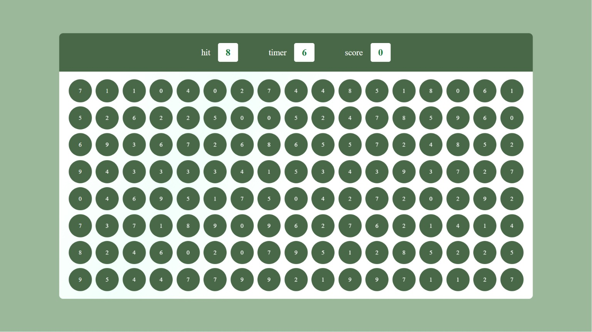
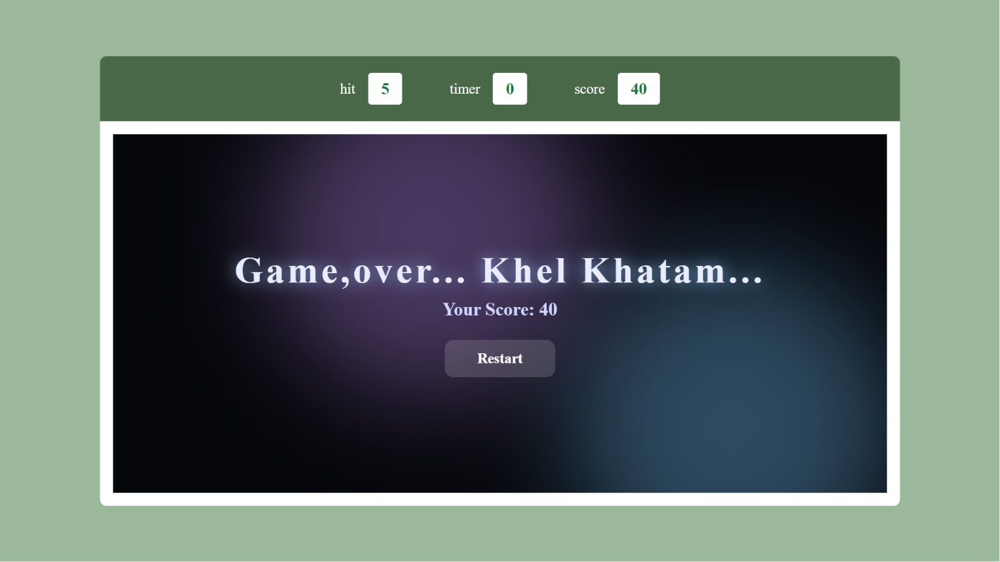

# 🫧 Bubble Pop - tests your focus

> You see a number. You click the bubble. Simple, right?  
> **WRONG.** The clock is eating your soul and your fingers can't keep up.

🎮 **[Play it live →](https://bubble-game-lyart.vercel.app/)**

---

## 👀 Screenshots

| Gameplay | Game Over |
|----------|-----------|
|  |  |

---

## 🎯 How it works

A grid of bubbles fills your screen, each showing a random digit (0–9). At the top you'll see a **hit** number — that's your target. Find the matching bubble and click it before time runs out.

Every correct click → **+10 score**, grid reshuffles, new target. Simple loop, brutal execution.

---

## 📜 Rules

- ⏱️ Timer starts at **6 seconds**
- ✅ Click the bubble matching the **hit** number to score
- 🔁 Every correct click regenerates the entire grid
- 🎁 Score when under 3s → get **+2 seconds** back
- ❌ Wrong bubble = nothing, but you just wasted time
- 💀 Timer hits 0 → **Khel Khatam**
- 🔄 Restart instantly, no page reload

---

## 🗂️ Files

```
├── index.html   ← the bones
├── style.css    ← the drip
└── script.js    ← the brain
```

---

## 🛠️ Built with

**HTML. CSS. JavaScript.** 
---

*Made with frustration, caffeine, and `setInterval`.*  
*If your high score is under 50, don't talk to me.*
